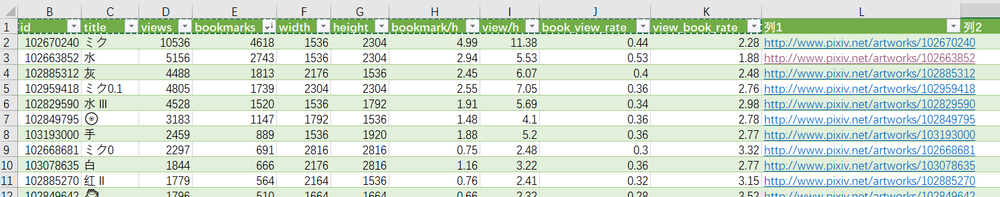

# Pixiv-Analytics

功能目前只有两个: 爬取某个作者的所有投稿, 导出数据到csv, 导出总结数据到txt. 基于[pixivpy](https://github.com/upbit/pixivpy)

包含项:


txt总结:
```
用户:[Ada] 88213414  |  Mon Dec 19 07:43:21 2022

投稿数:131  总阅读:72585  总收藏:26391  总图片数:186
 平均阅读:554.084
 平均收藏:201.458
 平均收藏/阅读:0.364
最高阅读:2290  pid102916847
最高收藏:1007  pid102916847

每投稿收藏/阅读比  mean:0.320  med:0.302  var:0.010  max:0.550  min:0.107
 阅读量/h (每投稿) mean:2.688  med:1.770  var:5.520  max:10.250  min:0.000
 收藏数/h (每投稿) mean:0.860  med:0.680  var:0.552  max:3.570  min:0.000
 阅读量   (每投稿) mean:554.084  med:430.000  var:145189.016  max:2290.000  min:2.000
```
## 使用
```bash
git clone https://github.com/trojblue/pixivAnalytics
cd pixivAnalytics

# 下载chromedriver, 放在pixiv_auth.py 同目录下
...

# 获取refresh token
python pixiv_auth.py login

# 创建txt文件存储refresh token
echo "YOUR TOKEN HERE" > ./privates/token.txt

# 传入用户UID: 如 www.pixiv.net/users/1039353
python get_stats.py -u 1039353
```

1. 用`pixiv_auth.py`获取refresh token: 见[pixivpy](https://github.com/upbit/pixivpy) →  [selenium](https://gist.github.com/upbit/6edda27cb1644e94183291109b8a5fde)
2. 在private文件夹下创建*.txt, 里面放你的refresh token
3. 开爬