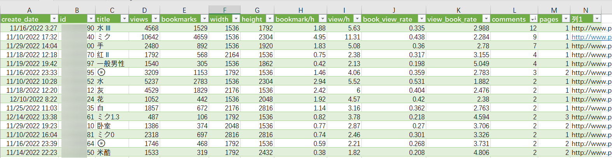

# Pixiv-Analytics

功能目前只有两个 (三个: 爬取某个作者的所有投稿, 导出数据到csv, 导出总结数据到txt. 基于[pixivpy](https://github.com/upbit/pixivpy)


## Crawler

见crawl_data.py


## Analytics

包含项:


txt总结:
```
用户: [YADA] 14626152  |  Mon Dec 19 08:59:48 2022

投稿数:49  总阅读:70855  总收藏:24121  总图片数:74
 平均阅读:1446.020
 平均收藏:492.265
 平均收藏/阅读:0.340
 平均图片数:1.510
 
最高阅读:10647  pid=102670240
最高收藏:4662  pid=102670240

每投稿收藏/阅读比  mean:0.281  med:0.270  var:0.009  max:0.531  min:0.076
 阅读量/h (每投稿) mean:3.815  med:2.920  var:7.769  max:13.810  min:0.510
 收藏数/h (每投稿) mean:1.200  med:0.780  var:1.151  max:4.950  min:0.040
 阅读量   (每投稿) mean:1446.020  med:792.000  var:3350813.187  max:10647.000  min:252.000
 收藏数   (每投稿) mean:492.265  med:205.000  var:663535.657  max:4662.000  min:44.000
```
## 使用
```bash
git clone https://github.com/trojblue/pixivAnalytics
cd pixivAnalytics

# 下载chromedriver, 放在pixiv_auth.py 同目录下
...

# 获取refresh token
python pixiv_auth.py login

# 创建txt文件存储refresh token
echo "YOUR TOKEN HERE" > ./privates/token.txt

# 传入用户UID: 如 www.pixiv.net/users/1039353
python get_stats.py -u 1039353
```

1. 用`pixiv_auth.py`获取refresh token: 见 [pixivpy](https://github.com/upbit/pixivpy) →  [selenium](https://gist.github.com/upbit/6edda27cb1644e94183291109b8a5fde)
2. 在private文件夹下创建*.txt, 里面放你的refresh token
3. 开爬